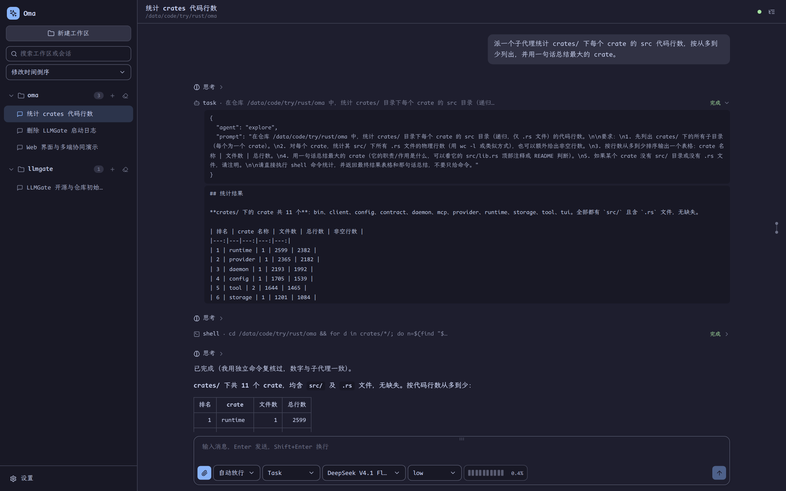
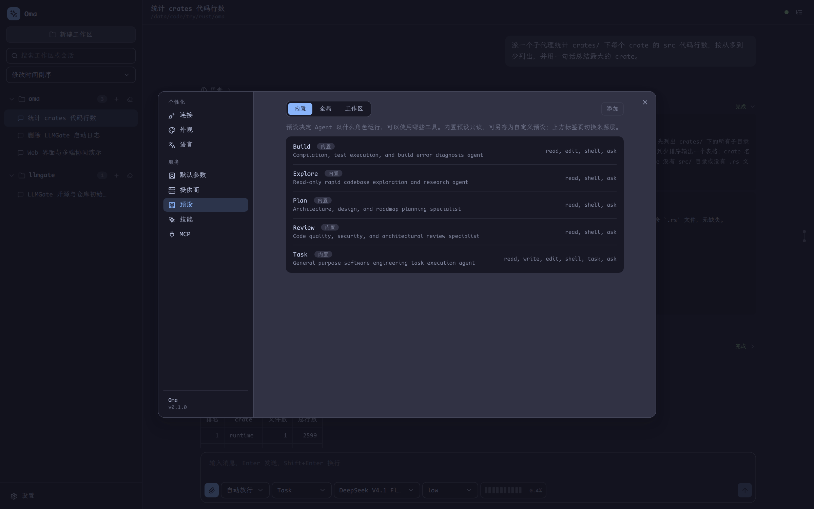
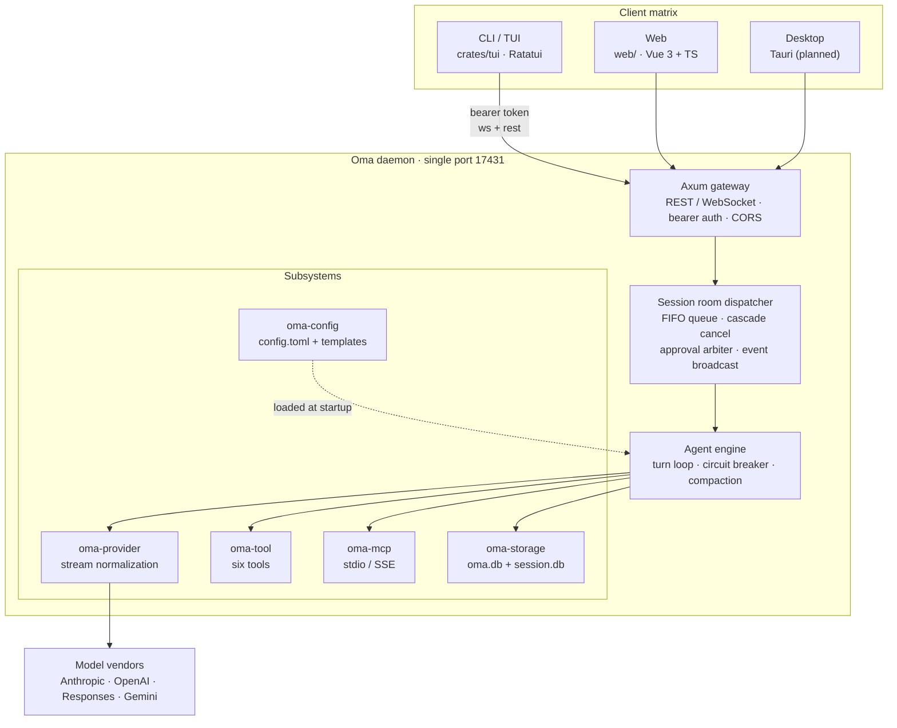

# Oma

[简体中文](README.md) · [English](README.en.md) · [日本語](README.ja.md)

> A multi-client AI agent workbench: one Rust daemon serving terminal, browser and desktop clients at the same time.

[](LICENSE)
[](rust-toolchain.toml)
[](web/package.json)
[](docs/multi_client_agent_spec.md)

Oma splits a complete coding agent into two layers: a **headless daemon core**
(sessions, models, tools and persistence all live on the Rust side) and **interchangeable clients**
(a terminal TUI and a web console today, a desktop client on the roadmap).

Several clients can attach to the same session at once — start a turn in the terminal and the browser
shows the same streaming output and the same tool cards, while an approval accepted on any client
takes effect everywhere.

The CLI and the UI are **Chinese-first** (Simplified Chinese is the default locale); the web client also
ships Traditional Chinese, English and Japanese.


---

## Table of contents

- [Features](#features)
- [Screenshots](#screenshots)
- [Architecture](#architecture)
- [Getting started](#getting-started)
- [Configuration](#configuration)
- [Built-in tools and agent presets](#built-in-tools-and-agent-presets)
- [Repository layout](#repository-layout)
- [Documentation](#documentation)
- [License](#license)

---

## Features

### Multi-client collaboration

- **One daemon, one port**: `127.0.0.1:17431` by default, serving both WebSocket (`/ws`) and REST (`/api/*`).
- **Session rooms**: every session is a room; events are broadcast to all attached clients over
  `tokio::broadcast`, and a late joiner receives a catch-up snapshot of the turn in flight instead of half a conversation.
- **FIFO commands and cascading cancel**: commands for one session run through a serial queue; a single
  `cancel` interrupts the current turn, drains the queue and propagates the abort into running subagents.
- **First-response-wins approvals**: the first decision from any client is broadcast to the rest;
  if nobody answers, the request auto-denies after 120 seconds. Modes: `normal` / `strict` / `auto`,
  with per-session allow-lists.

### Agent runtime

- **Turn-based agent loop**: thinking, text, tool calls and tool results are modelled as structured
  content blocks and persisted with the history.
- **A session tree, not a list**: messages carry a `parent_id`, so you can fork from any historical node;
  the web client renders a dedicated history tree.
- **Two-stage context management**: a 70% threshold derived from the model's declared `context_len`
  triggers tool-result truncation first and compaction second. An authoritative token anchor suppresses
  needless compaction so measured counts are never overwritten by heuristics.
- **Circuit breaker**: the turn aborts once consecutive tool failures cross a threshold, instead of
  spinning in a broken state.
- **Subagent delegation**: the `task` tool hands a sub-task to a subagent with its own preset
  (tool set + prompt); the subagent's stream is rendered inside the parent `task` card.

### Models and tools

- **Four provider protocols**, normalized through a hand-written SSE state machine: Anthropic Messages,
  OpenAI / DeepSeek Chat Completions, Responses, and Google Gemini. Tool calls and multimodal images map
  onto one shared `Block` model.
- **Three-level recursive merge** for headers and request bodies: provider $\prec$ model $\prec$
  reasoning-level override, so vendor-specific fields can be injected freely.
- **Six built-in tools**: `read` (including images), `write`, `edit` (atomic multi-hunk replacement with
  unified diff), `shell` (process-group guard with configurable timeout), `task` (subagent), and
  `ask` (ask the user when the request is ambiguous).
- **MCP support**: local stdio subprocesses and remote SSE, with tools registered under
  `mcp__{server}__{tool}`.
- **Per-model capabilities**: thinking / text / image and audio input-output are declared per model,
  and the UI decides from that whether to inline images or expose the thinking toggle.

### Clients

- **Web (`web/`)**: Vue 3 + TypeScript with hand-written CSS and **zero external UI or CSS libraries**;
  four Catppuccin palettes for dark and light, four locales, Markdown rendering, a history tree,
  a message rail, attachments and image previews.
- **TUI (`crates/tui`)**: a Ratatui terminal client with streaming output, approval dialogs,
  an ask panel and CJK-aware line wrapping.
- **CLI**: `oma daemon | web | tui | status`, with fully localized (Chinese) help and parse errors.
- **No runtime dependencies**: the frontend build output is embedded into the binary at compile time via
  `rust-embed`, so released binaries need no Node installation on the target machine.

---

## Screenshots

### Web console

Main session view: collapsible thinking, tool cards, tool results and one-click code copy.


Subagents: the `task` card embeds the subagent's full stream and its final conclusion.



Settings · Presets: five built-in agent presets, forkable into global or workspace-scoped custom presets.



### Terminal client


---

## Architecture



### Crate responsibilities

| Crate / directory | Responsibility |
|---|---|
| `crates/contract` | Pure types and protocol contracts (`Role`, `Block`, `ClientMessage`, `ServerMessage`, `AgentEvent`, …) with no heavy dependencies |
| `crates/storage` | Dual SQLite engine: global index `oma.db` and per-session `session.db`, WAL mode with a single-writer pool |
| `crates/provider` | Hand-written SSE state machine normalizing four streaming protocols (tool calls and multimodal included) |
| `crates/tool` | The six built-in tools, output truncation and tool allow-lists |
| `crates/mcp` | MCP client over local stdio and remote SSE with namespaced tool registration |
| `crates/config` | `config.toml` parsing, bundled agent templates, palettes and project-level overrides |
| `crates/runtime` | Agent loop, session rooms, command queue, cascade cancel, circuit breaker, compaction, approval arbiter |
| `crates/daemon` | Axum HTTP / WebSocket gateway, bearer auth middleware, REST routes |
| `crates/client` | Pure Rust client SDK: `OmaClient` (event stream and commands) and `SessionApi` (session management) |
| `crates/tui` | Ratatui terminal client |
| `crates/bin` | The `oma` executable: `daemon` / `web` / `tui` / `status` |
| `web/` | Vue 3 + TypeScript + hand-written CSS web client |

---

## Getting started

### Requirements

| Dependency | Version | Notes |
|---|---|---|
| Rust | nightly | Pinned by `rust-toolchain.toml` in this repo (`edition = "2024"`) |
| Node.js | ≥ 20 | Only needed to build the frontend; not needed at runtime |
| pnpm | ≥ 9 | Frontend package manager |

Platforms: Linux and macOS are the day-to-day development environments; Windows has the corresponding
`cfg` fallbacks but is untested.

### Build

The frontend assets are embedded into the binary at compile time by `rust-embed`, so **build the frontend first**:

```bash
# 1) frontend
cd web
pnpm install
pnpm build
cd ..

# 2) Rust
cargo build --release
```

The result is `target/release/oma`, self-contained: no `web/dist` directory is needed to ship it.

### Run

```bash
./target/release/oma daemon     # start the core, listening on 127.0.0.1:17431
./target/release/oma web        # start the web console on http://127.0.0.1:5173
./target/release/oma tui        # terminal client (reuses the latest session of this workspace)
./target/release/oma status     # show daemon status
```

First run:

1. Open the web console and go to **Settings → Connection**, filling in the address and token
   (defaults: `http://127.0.0.1:17431` / `admin`);
2. Go to **Settings → Providers** and add a provider (`api_type` and `base_url`) along with its models;
3. Create a session for a workspace, pick a model and start chatting.

> The daemon listens on the loopback interface only. Before exposing it to a LAN or the internet,
> **change `server.token` in `config.toml` to a strong secret**.

### Frontend development

```bash
cd web
pnpm dev        # Vite dev server; /api and /ws are proxied to 127.0.0.1:17431
pnpm test       # unit-level checks (stream segmentation, subagent rendering)
pnpm test:e2e   # end-to-end: a real daemon plus a fake vendor SSE server
```

In a debug `cargo build`, `rust-embed` reads `web/dist` straight from disk: after changing the frontend,
one `pnpm build` is enough — no Rust recompilation required.

---

## Configuration

The config file lives in `~/.config/oma/config.toml` (respecting `XDG_CONFIG_HOME`); data lives in
`~/.local/share/oma/`:

```text
~/.config/oma/
├── config.toml         # main config: server / theme / providers / mcp_servers
├── agents/             # global agent presets (*.md, YAML frontmatter + body)
└── themes/             # custom palettes (*.toml)
~/.local/share/oma/
├── oma.db              # global data such as the session index
└── sessions/<id>/session.db   # per-session message store and attachments
```

Minimal example:

```toml
default_model = "my_anthropic/claude-3-7-sonnet"
default_agent = "task"
default_approval_mode = "normal"

[server]
listen_addr = "127.0.0.1:17431"
token = "admin"

[providers.my_anthropic]
api_type = "anthropic"          # anthropic | completion | response | google
base_url = "https://api.anthropic.com"
api_key = "env:ANTHROPIC_API_KEY"   # env:VAR indirection is supported

[[providers.my_anthropic.models]]
id = "claude-3-7-sonnet"
name = "Claude 3.7 Sonnet"
context_len = 200000
capabilities = ["thinking", "text_input", "text_output", "image_input"]

[mcp_servers.local_sqlite]
type = "local"
command = "uvx"
args = ["mcp-server-sqlite", "--db-path", "oma.db"]
```

Token precedence: `--token` on the command line > `OMA_AUTH_TOKEN` environment variable > config file.
When the file has no token yet, the daemon writes the default `admin` back to disk so it stays visible
and editable.

Agent presets are looked up as `<workspace>/.oma/agents/*.md` (project) overriding
`~/.config/oma/agents/*.md` (global), falling back to the five bundled templates.

---

## Built-in tools and agent presets

| Tool | Description |
|---|---|
| `read` | Read a file by line range; images are inlined when the model can see them, otherwise a dimensions / channels / MIME summary is returned |
| `write` | Overwrite or create a file |
| `edit` | Atomic multi-hunk replacement with overlap checking and a unified diff |
| `shell` | Run a command in its own process group with a `killpg` fallback and a configurable timeout |
| `task` | Delegate a sub-task to a subagent with its own preset |
| `ask` | Ask the user when information is missing (single or multi select; the UI always adds a free-form "Other" entry) |

Bundled presets: **Build** (compilation and error diagnosis), **Explore** (read-only research),
**Plan** (architecture and planning), **Review** (code review), **Task** (general execution with every tool).

---

## Repository layout

```text
oma/
├── crates/
│   ├── bin/          # the `oma` command-line entry point
│   ├── client/       # Rust client SDK
│   ├── config/       # config parsing and bundled templates
│   ├── contract/     # protocol and data model
│   ├── daemon/       # Axum gateway
│   ├── mcp/          # MCP client
│   ├── provider/     # vendor streaming adapters
│   ├── runtime/      # agent runtime engine
│   ├── storage/      # SQLite persistence
│   ├── tool/         # built-in tools
│   └── tui/          # terminal client
├── docs/
│   ├── multi_client_agent_spec.md   # technical spec (protocol, DDL, config, API)
│   └── images/                      # README screenshots
├── web/              # Vue 3 + TypeScript web client
└── Cargo.toml        # workspace definition
```

---

## Documentation

- [Technical specification](docs/multi_client_agent_spec.md): architecture topology, WebSocket contract,
  SQLite DDL, configuration rules, REST API, tools and MCP extensibility, implementation notes.

---

## License

[MIT](LICENSE) © 2026 waittide
