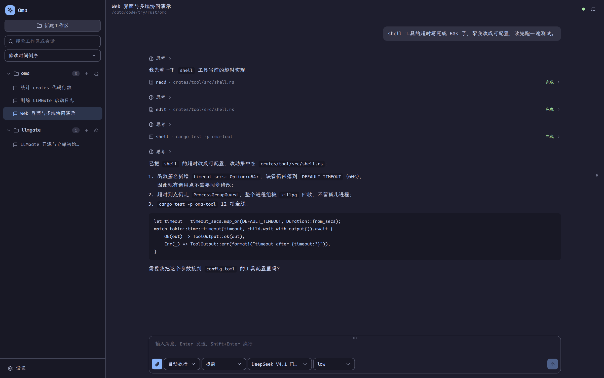
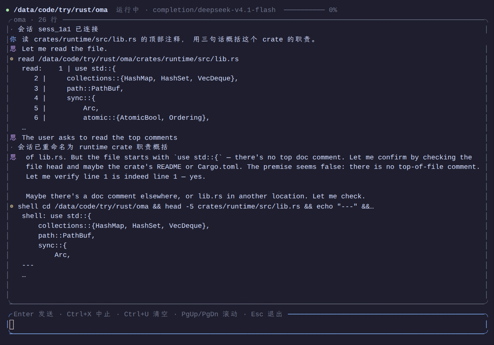
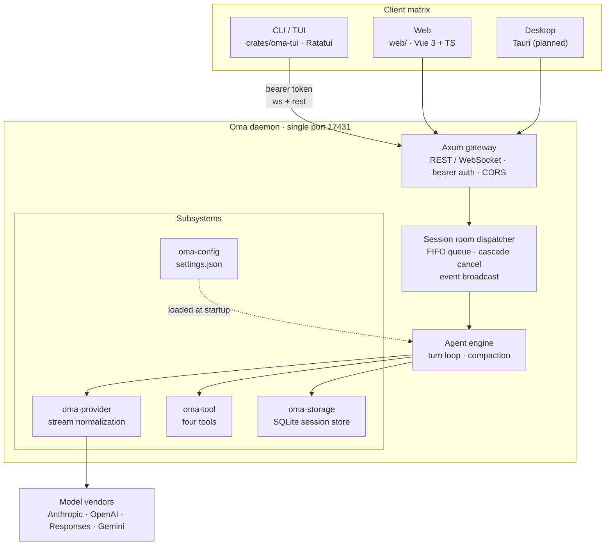

# Oma

[简体中文](README.md) · [English](README.en.md) · [日本語](README.ja.md)

> A multi-client AI agent workbench: one Rust daemon serving terminal, browser and desktop clients at the same time.

[](LICENSE)
[](https://github.com/waittide/oma/actions/workflows/build.yml)
[](rust-toolchain.toml)
[](web/package.json)
[](docs/multi_client_agent_spec.md)

Oma splits a complete coding agent into two layers: a **headless daemon core**
(sessions, models, tools and persistence all live on the Rust side) and **interchangeable clients**
(a terminal TUI and a web console today, a desktop client on the roadmap).

Several clients can attach to the same session at once — start a turn in the terminal and the browser
shows the same streaming output and the same tool cards.

The CLI and the UI are **Chinese-first** (Simplified Chinese is the default locale); the web client also
ships Traditional Chinese, English and Japanese.



---

## Table of contents

- [Features](#features)
- [Screenshots](#screenshots)
- [Architecture](#architecture)
- [Getting started](#getting-started)
- [Configuration](#configuration)
- [Built-in tools](#built-in-tools)
- [Repository layout](#repository-layout)
- [Documentation](#documentation)
- [License](#license)

---

## Features

### Multi-client collaboration

- **One daemon, one port**: `127.0.0.1:17431` by default, serving both WebSocket (`/ws`) and REST (`/api/*`).
- **Session rooms**: every session is a room; events are broadcast to all attached clients over
  `tokio::broadcast`, and a late joiner receives a catch-up snapshot of the turn in flight instead of half a conversation.
- **FIFO commands and cascading cancel**: commands for one session run through a serial queue; a single
  `cancel` interrupts the current turn and drains the queue.

### Agent runtime

- **Turn-based agent loop**: thinking, text, tool calls and tool results are modelled as structured
  content blocks and persisted with the history.
- **A session tree, not a list**: messages carry a `parent_id`, so you can fork from any historical node;
  the web client renders a dedicated history tree.
- **Two-stage context management**: a 70% threshold derived from the model's declared `context_len`
  triggers tool-result truncation first and compaction second. An authoritative token anchor suppresses
  needless compaction so measured counts are never overwritten by heuristics.

### Models and tools

- **Four provider protocols**, normalized through a hand-written SSE state machine: Anthropic Messages,
  OpenAI / DeepSeek Chat Completions, Responses, and Google Gemini. Tool calls and multimodal images map
  onto one shared `Block` model.
- **Three-level recursive merge** for headers and request bodies: provider $\prec$ model $\prec$
  reasoning-level override, so vendor-specific fields can be injected freely.
- **Four built-in tools**: `read` (including images), `write`, `edit` (apply_patch envelopes, several
  files per call) and `shell` (process-group guard with configurable timeout). The set stays minimal:
  read, write and execution only.
- **Per-model capabilities**: thinking / text / image and audio input-output are declared per model,
  and the UI decides from that whether to inline images or expose the thinking toggle.

### Clients

- **Web (`web/`)**: Vue 3 + TypeScript whose controls all come from `@waittide/ui` (a local link),
  with **no third-party UI or CSS framework** and hand-written application styles (`web/src` holds
  about 90 lines of CSS in total);
  four built-in Catppuccin palettes (light `latte`; dark `frappe` / `macchiato` / `mocha`,
  defaulting to dark `mocha` / light `latte`),
  four locales, Markdown rendering, a history tree, a message rail, attachments and image previews.
- **TUI (`crates/oma-tui`)**: a Ratatui terminal client with streaming output and CJK-aware line wrapping.
- **CLI**: `oma daemon | web | tui | status`, with fully localized (Chinese) help and parse errors.
- **No runtime dependencies**: the frontend build output is embedded into the binary at compile time via
  `rust-embed`, so released binaries need no Node installation on the target machine.

---

## Screenshots

### Web console

Main session view: collapsible thinking, tool cards, tool results and one-click code copy.


### Terminal client



---

## Architecture



### Crate responsibilities

| Crate / directory | Responsibility |
|---|---|
| `crates/oma-contract` | Pure types and protocol contracts (`Role`, `Block`, `ClientMessage`, `ServerMessage`, `AgentEvent`, …) with no heavy dependencies |
| `crates/oma-storage` | SQLite two-layer persistence: global index `oma.db` (session metadata) plus a per-session `session.db` (message tree and runtime state); attachments stay in `attachments/` |
| `crates/oma-provider` | Hand-written SSE state machine normalizing four streaming protocols (tool calls and multimodal included) |
| `crates/oma-tool` | The four built-in tools and output truncation |
| `crates/oma-config` | `settings.json` / `models.json` parsing, system prompt, palettes and project-level overrides |
| `crates/oma-runtime` | Agent loop, session rooms, command queue, cascade cancel, compaction |
| `crates/oma-daemon` | Axum HTTP / WebSocket gateway, bearer auth middleware, REST routes |
| `crates/oma-client` | Pure Rust client SDK: `OmaClient` (event stream and commands) and `SessionApi` (session management) |
| `crates/oma-tui` | Ratatui terminal client |
| `crates/oma` | The `oma` executable: `daemon` / `web` / `tui` / `status` |
| `web/` | Vue 3 + TypeScript web client, controls from `@waittide/ui` |

---

## Getting started

### Requirements

| Dependency | Version | Notes |
|---|---|---|
| Rust | nightly | Pinned by `rust-toolchain.toml` in this repo (`edition = "2024"`) |
| Node.js | ≥ 20 | Only needed to build the frontend; not needed at runtime |
| pnpm | ≥ 9 | Frontend package manager |

Platforms: Linux and macOS are the day-to-day development environments; Windows has the corresponding
`cfg` fallbacks but is untested.

### Download a prebuilt binary

If you would rather not set up the toolchain, grab a binary built by GitHub Actions:

| Route | Where | Notes |
|---|---|---|
| Daily snapshots | [Releases](https://github.com/waittide/oma/releases) | A date-stamped snapshot such as `v2026.09.17` is published automatically every day at 00:00 (UTC+8). Marked as a pre-release, so it never takes over Latest |
| Stable releases | Same page | Push a semantic tag such as `v0.2.0` by hand; it becomes the Latest release |
| A specific build | [Actions](https://github.com/waittide/oma/actions/workflows/build.yml) → pick a run → **Artifacts** at the bottom | Every push / PR builds; artifacts are kept for 90 days |
| Manual run | Same page → **Run workflow** | Rebuild and download without touching the code |

Releases run on two independent tracks: daily snapshots only add a date tag and never touch the source,
giving you a fresh build to grab at any time; stable releases are semantic tags you maintain by hand to
mark milestones. A binary reports its own version as e.g. `0.2.0+1a2b3c4` (version plus short commit
hash), so any artifact can be traced back to an exact commit:

```bash
oma --version    # oma 0.2.0+1a2b3c4
oma status       # version of a running daemon, from /api/server/status
```

The repository is public, so artifacts can be downloaded without signing in. Archives are named
`oma-<version>-<target>.tar.gz` (`.zip` on Windows) and contain a self-contained `oma` executable plus
`README.md` and `LICENSE` — the frontend assets are embedded at compile time, so **no Node and no
`web/dist` directory are needed at runtime**:

| Platform | Target |
|---|---|
| Linux x86_64 | `x86_64-unknown-linux-gnu` |
| Linux aarch64 | `aarch64-unknown-linux-gnu` |
| macOS Apple Silicon | `aarch64-apple-darwin` |
| macOS Intel | `x86_64-apple-darwin` |
| Windows x86_64 | `x86_64-pc-windows-msvc` |

```bash
tar xzf oma-0.1.0-x86_64-unknown-linux-gnu.tar.gz
cd oma-0.1.0-x86_64-unknown-linux-gnu
./oma daemon     # terminal A: the core
./oma web        # terminal B: the web console
```

### Build

The frontend assets are embedded into the binary at compile time by `rust-embed`, so **build the
frontend first**. A missing `web/dist` does not fail `cargo build` (`crates/oma/build.rs` creates an
empty directory and warns), but `oma web` then reports the missing assets at startup:

```bash
# 1) frontend
cd web
pnpm install
pnpm build
cd ..

# 2) Rust
cargo build --release
```

The result is `target/release/oma`, self-contained: no `web/dist` directory is needed to ship it.

### Run

```bash
./target/release/oma daemon     # start the core, listening on 127.0.0.1:17431
./target/release/oma web        # start the web console on http://127.0.0.1:5173
./target/release/oma tui        # terminal client (reuses the latest session of this workspace)
./target/release/oma status     # show daemon status
```

First run:

1. Open the web console and go to **Settings → Connection**, filling in the address and token
   (defaults: `http://127.0.0.1:17431` / `admin`);
2. Go to **Settings → Providers** and add a provider (`api_type` and `base_url`) along with its models;
3. Create a session for a workspace, pick a model and start chatting.

> The daemon listens on the loopback interface only. Before exposing it to a LAN or the internet,
> **change `server.token` in `settings.json` to a strong secret**.

### Frontend development

```bash
cd web
pnpm dev        # Vite dev server; /api and /ws are proxied to 127.0.0.1:17431
pnpm test       # checks: stream segmentation, usage totals, duration wording, patch parsing, change tree, status kinds, refresh signal
```

End-to-end tests live on the Rust side rather than in the frontend project: `cargo test -p oma-daemon`
runs `crates/oma-daemon/tests/e2e_smoke.rs` (a real daemon plus a fake vendor SSE server).

In a debug `cargo build`, `rust-embed` reads `web/dist` straight from disk: after changing the frontend,
one `pnpm build` is enough — no Rust recompilation required.

---

## Configuration

The config directory is `~/.config/oma/` (respecting `XDG_CONFIG_HOME`); data lives in
`~/.local/share/oma/`:

```text
~/.config/oma/
├── settings.json       # general settings: defaults, agent, theme, server
├── models.json         # providers and model catalogue
├── agents/             # agent presets (<id>.md, overriding the bundled templates)
├── skills/             # oma's own skills (<id>/SKILL.md)
└── themes/             # custom palettes (*.json)
~/.local/share/oma/
├── oma.db                     # global index: session metadata (lists and details read only this)
└── sessions/<id>/             # one directory per session
    ├── session.db             # session DB: message tree + session_meta runtime state
    └── attachments/           # session attachments
```


Minimal example (`settings.json`):

```json
{
  "default_model": "my_anthropic/claude-3-7-sonnet",
  "default_agent": "build",
  "default_reasoning_level": "medium",
  "server": { "host": "127.0.0.1", "port": 17431, "token": "admin" }
}
```

Providers and models (`models.json`):

```json
{
  "providers": {
    "my_anthropic": {
      "api_type": "anthropic",
      "base_url": "https://api.anthropic.com",
      "api_key": "env:ANTHROPIC_API_KEY",
      "models": [
        {
          "id": "claude-3-7-sonnet",
          "name": "Claude 3.7 Sonnet",
          "context_len": 200000,
          "capabilities": ["thinking", "text_input", "text_output", "image_input"]
        }
      ]
    }
  }
}
```

`api_type` is one of `anthropic | completion | response | google`; `api_key` supports `env:VAR`
indirection.

Token precedence: `--token` on the command line > `OMA_AUTH_TOKEN` environment variable > config file.
When the file has no token yet, the daemon writes the default `admin` back to disk so it stays visible
and editable.

Agent presets decide which system prompt a session uses and which tools it may call; four templates are
bundled: `plan` / `explore` / `review` / `build` (the template *is* the prompt). The default preset is
`build`, which declares no `tools` list and therefore has every tool available. Files in
`<workspace>/.oma/agents/<id>.md` (project) and `~/.config/oma/agents/<id>.md` (global) override the
bundled templates or add new presets; the settings panel's presets page can create, edit and delete
them, and tool grants come from `GET /api/tools`. For lighter-weight extras, use skills.

---

## Built-in tools

| Tool | Description |
|---|---|
| `read` | Read a file by line range; images are inlined when the model can see them, otherwise a dimensions / channels / MIME summary is returned |
| `write` | Overwrite or create a file |
| `edit` | apply_patch: `input` holds a patch wrapped in `*** Begin Patch` … `*** End Patch`, adding / deleting / updating files (with `*** Move to:` for renames), several files per call, and nothing is written unless the whole patch applies |
| `shell` | Run a command in its own process group with a `killpg` fallback and a configurable timeout |

The set stays minimal: read, write and execution only.

---

## Documentation

- [Technical specification](docs/multi_client_agent_spec.md): architecture topology, WebSocket contract,
  JSONL session format, configuration rules, REST API, implementation notes.
---

## License

[MIT](LICENSE) © 2026 waittide
