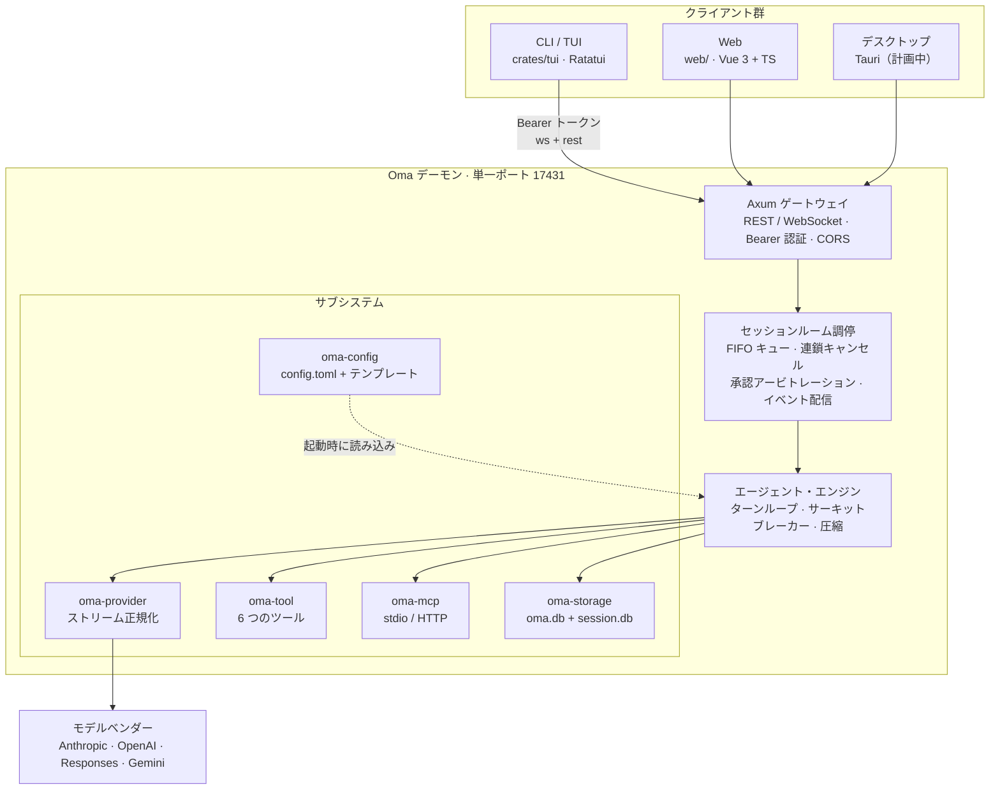

# Oma

[简体中文](README.md) · [English](README.en.md) · [日本語](README.ja.md)

> マルチクライアント対応の AI エージェント・ワークベンチ。1 つの Rust デーモンが、ターミナル・ブラウザ・デスクトップの各クライアントに同時にサービスを提供します。

[](LICENSE)
[](https://github.com/waittide/oma/actions/workflows/build.yml)
[](rust-toolchain.toml)
[](web/package.json)
[](docs/multi_client_agent_spec.md)

Oma はコーディングエージェントを 2 層に分離します。**ヘッドレスのデーモン・コア**
（セッション・モデル・ツール・永続化はすべて Rust 側）と、**差し替え可能なクライアント**
（現在はターミナル TUI と Web コンソール、デスクトップ版は計画中）です。

複数のクライアントが同じセッションに同時接続できます。ターミナルで開始したターンはブラウザにも
同じストリーミング出力と同じツールカードとして現れ、どのクライアントで承認しても全クライアントに反映されます。

CLI と UI は**中国語（簡体字）を第一言語**とし、Web クライアントは繁体字中国語・英語・日本語にも対応します。


---

## 目次

- [特徴](#特徴)
- [スクリーンショット](#スクリーンショット)
- [アーキテクチャ](#アーキテクチャ)
- [はじめかた](#はじめかた)
- [設定](#設定)
- [組み込みツールとエージェント・プリセット](#組み込みツールとエージェントプリセット)
- [リポジトリ構成](#リポジトリ構成)
- [ドキュメント](#ドキュメント)
- [ライセンス](#ライセンス)

---

## 特徴

### マルチクライアント協調

- **単一デーモン・単一ポート**: 既定は `127.0.0.1:17431`。WebSocket（`/ws`）と REST（`/api/*`）を同じポートで処理します。
- **セッションルーム**: セッションごとに 1 つのルームを作り、イベントは `tokio::broadcast` で接続中の
  全クライアントへ配信されます。途中から接続したクライアントには、進行中ターンの追いつき用スナップショットが送られるため、
  会話の後半だけが見えることはありません。
- **FIFO コマンドと連鎖キャンセル**: 同一セッションの命令は直列キューで処理されます。1 回の `cancel` で
  現在のターンを中断し、待機中の命令を破棄し、実行中のサブエージェントにも中断を伝播します。
- **先着順の承認アービトレーション**: いずれかのクライアントの判断が即座に他へ配信されます。
  誰も応答しない場合は 120 秒で自動拒否。モードは `normal` / `strict` / `auto` の 3 段階で、
  セッション単位の許可リストも持てます。

### エージェント・ランタイム

- **ターン制エージェントループ**: 思考・本文・ツール呼び出し・ツール結果はすべて構造化コンテンツブロックとして
  モデル化され、履歴と一緒に永続化されます。
- **リストではなくツリー**: メッセージは `parent_id` を持つため、履歴の任意のノードから分岐して再開できます。
  Web クライアントには専用の履歴ツリー表示があります。
- **2 段階のコンテキスト管理**: モデルが宣言した `context_len` から 70% のしきい値を計算し、
  まずツール結果の切り詰め、次に圧縮を行います。権威あるトークン・アンカーは不要な圧縮を抑止し、
  実測値をヒューリスティックな推定で上書きしません。
- **サーキットブレーカー**: ツール失敗が連続してしきい値に達すると、そのターンを中断します。
- **サブエージェント委譲**: `task` ツールは専用プリセット（ツールセット + プロンプト）を持つ
  サブエージェントに下位タスクを委譲し、そのストリームは親の `task` カード内に描画されます。

### モデルとツール

- **4 種類のプロバイダ・プロトコル**を自作の SSE ステートマシンで正規化します。Anthropic Messages、
  OpenAI / DeepSeek Chat Completions、Responses、Google Gemini。ツール呼び出しとマルチモーダル画像は
  共通の `Block` モデルにマッピングされます。
- **ヘッダー / リクエストボディの 3 段階マージ**: プロバイダー $\prec$ モデル $\prec$ 推論レベル上書き。
  ベンダー固有フィールドを自由に注入できます。
- **6 つの組み込みツール**: `read`（画像対応）、`write`、`edit`（重複検査付きの原子的マルチハンク置換 + unified diff）、
  `shell`（プロセスグループ監視 + 設定可能なタイムアウト）、`task`（サブエージェント）、
  `ask`（曖昧なときにユーザーへ質問）。
- **MCP 対応**: ローカル stdio サブプロセスとリモート HTTP（JSON-RPC over POST）。ツールは `mcp__{server}__{tool}` の
  名前空間で登録されます。
- **モデル単位の能力宣言**: 思考・テキスト・画像・音声の入出力をモデルごとに宣言し、
  画像をインライン表示するか思考トグルを出すかを UI が判断します。

### クライアント

- **Web（`web/`）**: Vue 3 + TypeScript、CSS は手書きで**外部 UI / CSS ライブラリはゼロ**。
  Catppuccin のダーク / ライト各 4 パレット、4 言語、Markdown レンダリング、履歴ツリー、
  メッセージレール、添付と画像プレビュー。
- **TUI（`crates/tui`）**: Ratatui 製のターミナルクライアント。ストリーミング表示、承認ダイアログ、
  ask パネル、CJK 対応の折り返し。
- **CLI**: `oma daemon | web | tui | status`。ヘルプと解析エラーはすべて中国語化されています。
- **実行時依存なし**: フロントエンドのビルド成果物はコンパイル時に `rust-embed` でバイナリへ埋め込まれるため、
  配布先に Node は不要です。

---

## スクリーンショット

### Web コンソール

セッション画面：折りたたみ可能な思考、ツールカード、ツール結果、コードのワンクリックコピー。


サブエージェント：`task` カードがサブエージェントのストリーム全体と最終結論を内包します。


設定 · プリセット：組み込みの 5 プリセット。グローバル / ワークスペース単位のカスタムプリセットとして保存できます。


### ターミナルクライアント


---

## アーキテクチャ



### クレートの責務

| クレート / ディレクトリ | 責務 |
|---|---|
| `crates/contract` | 純粋な型とプロトコル契約（`Role`、`Block`、`ClientMessage`、`ServerMessage`、`AgentEvent` など）。重い依存なし |
| `crates/storage` | 二重 SQLite エンジン：全体インデックス `oma.db` とセッション別 `session.db`、WAL と単一ライタ |
| `crates/provider` | 自作 SSE ステートマシンによる 4 プロトコルの正規化（ツール呼び出し・マルチモーダル含む） |
| `crates/tool` | 6 つの組み込みツール、出力切り詰め、ツール許可リスト |
| `crates/mcp` | MCP クライアント：ローカル stdio とリモート HTTP（JSON-RPC over POST）、名前空間付きツール登録 |
| `crates/config` | `config.toml` の解析、組み込みエージェントテンプレート、パレット、プロジェクト単位の上書き |
| `crates/runtime` | エージェントループ、セッションルーム、コマンドキュー、連鎖キャンセル、サーキットブレーカー、圧縮、承認アービトレーション |
| `crates/daemon` | Axum による HTTP / WebSocket ゲートウェイ、Bearer 認証ミドルウェア、REST ルート |
| `crates/client` | 純 Rust クライアント SDK：`OmaClient`（イベントストリームと命令）と `SessionApi`（セッション管理） |
| `crates/tui` | Ratatui 製ターミナルクライアント |
| `crates/bin` | `oma` 実行ファイル：`daemon` / `web` / `tui` / `status` |
| `web/` | Vue 3 + TypeScript + 手書き CSS の Web クライアント |

---

## はじめかた

### 必要な環境

| 依存 | バージョン | 補足 |
|---|---|---|
| Rust | nightly | リポジトリの `rust-toolchain.toml` で nightly に固定（`edition = "2024"`） |
| Node.js | ≥ 20 | フロントエンドのビルド時のみ。実行時は不要 |
| pnpm | ≥ 9 | フロントエンドのパッケージマネージャ |

対応プラットフォーム：Linux と macOS が日常の開発環境です。Windows には対応する `cfg` フォールバックがありますが未検証です。

### ビルド済みバイナリをダウンロードする

ツールチェーンを用意したくない場合は、GitHub Actions がビルドしたバイナリをそのまま使えます。

| 入手方法 | 場所 | 補足 |
|---|---|---|
| デイリースナップショット | [Releases](https://github.com/waittide/oma/releases) | 毎日 00:00（UTC+8）に `v2026.09.17` のような日付版が自動リリースされます。pre-release 扱いのため Latest は奪いません |
| 正式リリース | 同じページ | `v0.2.0` のようなセマンティックタグを手動で push すると Latest になります |
| 特定のビルド | [Actions](https://github.com/waittide/oma/actions/workflows/build.yml) → run を選択 → ページ下部の **Artifacts** | push / PR ごとにビルドされ、成果物は 90 日保持されます |
| 手動実行 | 同じページの **Run workflow** | コードを変更せずに再ビルドして取得できます |

リリースは互いに干渉しない 2 本のトラックで運用します。デイリースナップショットは日付タグを
付けるだけでソースには触れず、いつでも最新ビルドを取れます。正式リリースは人が手動で
セマンティックタグを打ち、有意なマイルストーンを示します。バイナリの自己申告バージョンは
`0.2.0+1a2b3c4`（バージョン + コミット短縮ハッシュ）の形式なので、どの成果物からも
該当コミットを辿れます:

```bash
oma --version    # oma 0.2.0+1a2b3c4
oma status       # 起動中の Daemon のバージョン（/api/server/status 由来）
```

リポジトリは公開のため、Artifacts はサインインなしでダウンロードできます。ファイル名は
`oma-<バージョン>-<target>.tar.gz`（Windows は `.zip`）で、中身は自己完結した `oma` 実行ファイルと
`README.md` / `LICENSE` です。フロントエンド資産はコンパイル時に埋め込まれるため、**実行時に Node も
`web/dist` も不要**です。

| プラットフォーム | target |
|---|---|
| Linux x86_64 | `x86_64-unknown-linux-gnu` |
| Linux aarch64 | `aarch64-unknown-linux-gnu` |
| macOS Apple Silicon | `aarch64-apple-darwin` |
| macOS Intel | `x86_64-apple-darwin` |
| Windows x86_64 | `x86_64-pc-windows-msvc` |

```bash
tar xzf oma-0.1.0-x86_64-unknown-linux-gnu.tar.gz
cd oma-0.1.0-x86_64-unknown-linux-gnu
./oma daemon     # ターミナル A：コア
./oma web        # ターミナル B：Web コンソール
```

### ビルド

フロントエンドの成果物はコンパイル時に `rust-embed` でバイナリへ埋め込まれるため、**先にフロントエンドをビルド**します。

```bash
# 1) フロントエンド
cd web
pnpm install
pnpm build
cd ..

# 2) Rust
cargo build --release
```

成果物は `target/release/oma` で自己完結しており、配布時に `web/dist` は不要です。

### 実行

```bash
./target/release/oma daemon     # コアを起動（既定 127.0.0.1:17431）
./target/release/oma web        # Web コンソールを起動（既定 http://127.0.0.1:5173）
./target/release/oma tui        # ターミナルクライアント（このワークスペースの最新セッションを再利用）
./target/release/oma status     # デーモンの状態を表示
```

初回の手順：

1. Web コンソールで **設定 → 接続** を開き、アドレスとトークンを入力（既定は `http://127.0.0.1:17431` / `admin`）;
2. **設定 → プロバイダー** でプロバイダー（`api_type` と `base_url`）とモデルを追加;
3. ワークスペースのセッションを作成し、モデルを選んで会話を開始。

> デーモンは既定でループバックのみを待ち受けます。LAN やインターネットへ公開する前に、
> **`config.toml` の `server.token` を必ず強力な秘密値へ変更してください**。

### フロントエンド開発

```bash
cd web
pnpm dev        # Vite 開発サーバー。/api と /ws は 127.0.0.1:17431 へプロキシ
pnpm test       # 単体レベルの検証（ストリーム分割、サブエージェント描画）
pnpm test:e2e   # エンドツーエンド：実デーモン + 偽ベンダー SSE サーバー
```

debug ビルドの `cargo build` では `rust-embed` が `web/dist` をディスクから直接読むため、
フロントエンドを変更したら `pnpm build` を 1 回実行するだけで反映されます（Rust の再コンパイルは不要）。

---

## 設定

設定ファイルは `~/.config/oma/config.toml`（`XDG_CONFIG_HOME` に追従）、データは `~/.local/share/oma/` に置かれます。

```text
~/.config/oma/
├── config.toml         # 主設定: server / theme / providers / mcp_servers
├── agents/             # グローバルなエージェント・プリセット（*.md、YAML frontmatter + 本文）
└── themes/             # カスタムパレット（*.toml）
~/.local/share/oma/
├── oma.db              # セッション索引などの全体データ
└── sessions/<id>/session.db   # セッションごとのメッセージ保存と添付
```

最小構成の例：

```toml
default_model = "my_anthropic/claude-3-7-sonnet"
default_agent = "task"
default_approval_mode = "normal"

[server]
listen_addr = "127.0.0.1:17431"
token = "admin"

[providers.my_anthropic]
api_type = "anthropic"          # anthropic | completion | response | google
base_url = "https://api.anthropic.com"
api_key = "env:ANTHROPIC_API_KEY"   # env:VAR による間接参照に対応

[[providers.my_anthropic.models]]
id = "claude-3-7-sonnet"
name = "Claude 3.7 Sonnet"
context_len = 200000
capabilities = ["thinking", "text_input", "text_output", "image_input"]

[mcp_servers.local_sqlite]
type = "local"
command = "uvx"
args = ["mcp-server-sqlite", "--db-path", "oma.db"]
```

トークンの優先順位：コマンドラインの `--token` > 環境変数 `OMA_AUTH_TOKEN` > 設定ファイル。
設定ファイルにトークンが無い場合、デーモンは既定値 `admin` を書き戻して保存します
（ユーザーが確認・変更できるようにするため）。

エージェント・プリセットの探索順は、プロジェクト単位の `<workspace>/.oma/agents/*.md` が
グローバルの `~/.config/oma/agents/*.md` を上書きし、最後に組み込みの 5 テンプレートへフォールバックします。

---

## 組み込みツールとエージェント・プリセット

| ツール | 説明 |
|---|---|
| `read` | 行範囲を指定してファイルを読む。画像はモデルが視覚対応ならインライン、そうでなければ寸法 / チャンネル / MIME の要約を返す |
| `write` | ファイルの上書きまたは新規作成 |
| `edit` | 重複検査付きの原子的マルチハンク置換（unified diff を出力） |
| `shell` | 専用プロセスグループでコマンドを実行し、`killpg` でフォールバック。タイムアウトは設定可能 |
| `task` | 専用プリセットを持つサブエージェントへ下位タスクを委譲 |
| `ask` | 情報が不足しているときにユーザーへ質問（単一 / 複数選択。UI が「その他」の自由入力を自動で付加） |

組み込みプリセット：**Build**（ビルドとエラー診断）、**Explore**（読み取り専用の調査）、
**Plan**（設計と計画）、**Review**（コードレビュー）、**Task**（全ツールを持つ汎用実行）。

---

## リポジトリ構成

```text
oma/
├── crates/
│   ├── bin/          # `oma` コマンドライン入口
│   ├── client/       # Rust クライアント SDK
│   ├── config/       # 設定解析と組み込みテンプレート
│   ├── contract/     # プロトコルとデータモデル
│   ├── daemon/       # Axum ゲートウェイ
│   ├── mcp/          # MCP クライアント
│   ├── provider/     # ベンダー別ストリーミングアダプタ
│   ├── runtime/      # エージェント・ランタイム
│   ├── storage/      # SQLite 永続化
│   ├── tool/         # 組み込みツール
│   └── tui/          # ターミナルクライアント
├── docs/
│   ├── multi_client_agent_spec.md   # 技術仕様書（プロトコル・DDL・設定・API）
│   └── images/                      # README 用スクリーンショット
├── web/              # Vue 3 + TypeScript の Web クライアント
└── Cargo.toml        # ワークスペース定義
```

---

## ドキュメント

- [技術仕様書](docs/multi_client_agent_spec.md)：アーキテクチャ、WebSocket 契約、SQLite DDL、
  設定仕様、REST API、ツールと MCP 拡張、実装との一致に関する注記。

---

## ライセンス

[MIT](LICENSE) © 2026 waittide
