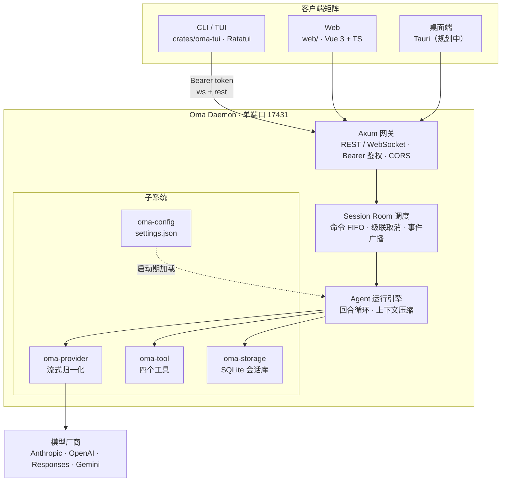

# Oma

[简体中文](README.md) · [English](README.en.md) · [日本語](README.ja.md)

> 多端协同的 AI Agent 工作台：一个 Rust 内核 Daemon，同时服务终端、浏览器与桌面客户端。

[](LICENSE)
[](https://github.com/waittide/oma/actions/workflows/build.yml)
[](rust-toolchain.toml)
[](web/package.json)
[](docs/multi_client_agent_spec.md)

Oma 把一个完整的编码 Agent 拆成两层：**无头的 Daemon 内核**（会话、模型、工具、持久化全部在 Rust 侧）
和**可替换的客户端**（终端 TUI、Web 控制台，桌面端在规划中）。
多个客户端可以同时接入同一个会话——你在终端里发起的一轮对话，浏览器上能看到同样的流式输出、同样的工具调用卡片。

界面与命令行以**简体中文为第一语言**，Web 端内置简体中文 / 繁體中文 / English / 日本語四套文案。


---

## 目录

- [特性](#特性)
- [截图](#截图)
- [架构](#架构)
- [快速开始](#快速开始)
- [配置](#配置)
- [内置工具](#内置工具)
- [目录结构](#目录结构)
- [文档](#文档)
- [许可证](#许可证)

---

## 特性

### 多端协同

- **单 Daemon 单端口**：默认 `127.0.0.1:17431`，一个端口同时承载 WebSocket（`/ws`）与 REST（`/api/*`）。
- **会话房间（Session Room）**：每个会话一个房间，事件经 `tokio::broadcast` 广播给全部在线客户端，
  新接入的客户端会收到进行中轮次的追平快照（catch-up），不会看到半截对话。
- **命令 FIFO 与级联取消**：同会话指令进入串行队列；一次 `cancel` 会中断当前轮次并清空排队指令。

### Agent 运行引擎

- **回合制 Agent Loop**：思考、正文、工具调用、工具结果全部建模为结构化 Content Block，随历史落库。
- **会话树而非线性列表**：消息带 `parent_id`，可以从历史任意节点分叉重开，Web 端有专门的历史树视图。
- **两级上下文管理**：按模型声明的 `context_len` 计算 70% 阈值，先做工具结果截断、再做两阶段压缩；
  权威 Token 锚点会抑制不必要的压缩，避免把已知的准确值覆盖成启发式估算。

### 模型与工具

- **四种协议归一化**（手写 SSE 状态机）：Anthropic Messages、OpenAI / DeepSeek Chat Completions、
  Responses、Google Gemini。工具调用与多模态图片在四种协议下统一成同一套 `Block`。
- **请求头 / 请求体三级递归合并**：Provider 级 $\prec$ Model 级 $\prec$ 推理等级覆盖，可注入厂商私有字段。
- **四个内置工具**：`read`（支持读图片）、`write`、`edit`（apply_patch 补丁，一次可改多个文件）、
  `shell`（进程组守卫 + 可配置超时）。
  内核只保留最小可用的读写与执行能力。
- **可配置的展示能力**：模型能力（思考 / 文本 / 图片输入输出 / 音频）逐模型声明，
  界面据此决定是否内联图片、是否展示思考开关。

### 客户端

- **Web（`web/`）**：Vue 3 + TypeScript，控件全部来自本地 link 的 `@waittide/ui`，
  **不引入第三方 UI / CSS 框架**，应用层样式手写（`web/src` 下仅约 90 行 CSS）；
  内置 4 套 Catppuccin 调色板（浅色 `latte`，深色 `frappe` / `macchiato` / `mocha`，
  默认深色 `mocha` + 浅色 `latte`）、
  四语言文案、Markdown 渲染、历史树、消息导航栏、附件与图片预览。
- **TUI（`crates/oma-tui`）**：基于 Ratatui 的终端客户端，流式渲染、CJK 折行。
- **CLI**：`oma daemon | web | tui | status`，帮助与解析错误全部中文化。
- **零运行时依赖**：前端构建产物在编译期经 `rust-embed` 内嵌进二进制，发布时不需要目标机器安装 Node。

---

## 截图

### Web 控制台

会话主界面：思考折叠、工具调用卡片、工具回执、代码块一键复制。


### 终端客户端


---

## 架构



### Crates 职责

| Crate / 目录 | 职责 |
|---|---|
| `crates/oma-contract` | 纯类型与协议契约（`Role`、`Block`、`ClientMessage`、`ServerMessage`、`AgentEvent` 等），零重依赖 |
| `crates/oma-storage` | SQLite 双层持久化：全局索引库 `oma.db`（会话元数据）+ 每会话库 `session.db`（messages 消息树与运行时状态），附件落 `attachments/` 目录 |
| `crates/oma-provider` | 手写 SSE 状态机，归一化四家流式协议（含工具调用与多模态） |
| `crates/oma-tool` | 四个内置工具与输出截断 |
| `crates/oma-config` | `settings.json` / `models.json` 解析、系统提示词、调色板与项目级覆盖 |
| `crates/oma-runtime` | Agent Loop、会话房间、命令队列、级联取消、上下文压缩 |
| `crates/oma-daemon` | Axum HTTP / WebSocket 网关、Bearer 鉴权中间件、REST 路由 |
| `crates/oma-client` | 纯 Rust 客户端 SDK：`OmaClient`（事件流与指令）与 `SessionApi`（会话管理） |
| `crates/oma-tui` | Ratatui 终端客户端 |
| `crates/oma` | 统一可执行文件 `oma`：`daemon` / `web` / `tui` / `status` |
| `web/` | Vue 3 + TypeScript 的 Web 客户端，控件来自 `@waittide/ui` |

---

## 快速开始

### 环境要求

| 依赖 | 版本 | 说明 |
|---|---|---|
| Rust | nightly | 仓库内 `rust-toolchain.toml` 已固定为 nightly（`edition = "2024"`） |
| Node.js | ≥ 20 | 仅构建前端需要；运行时不需要 Node |
| pnpm | ≥ 9 | 前端包管理器 |
| `waittide-ui` | 同级目录 | 前端控件库，以 `link:../waittide-ui/packages/ui` 引入；**构建 Web 前端前必须先 clone 到本仓库的同级目录**，只用预编译产物则不需要 |

平台：Linux 与 macOS 为日常开发环境；Windows 具备对应 `cfg` 回退分支，但未做验证。

### 直接下载预编译产物

不想自己搭工具链时，直接用 GitHub Actions 构建好的二进制：

| 方式 | 位置 | 说明 |
|---|---|---|
| 每日快照 | [Releases](https://github.com/waittide/oma/releases) | 每天 00:00 自动发布日期版本，如 `v2026.09.17`。标记为 pre-release，不会占用 Latest |
| 正式版本 | 同上 | 手工推送语义化标签，如 `v0.2.0`，成为 Releases 页的 Latest |
| 某次构建 | [Actions](https://github.com/waittide/oma/actions/workflows/build.yml) → 选中一条 run → 页面底部 **Artifacts** | 每次 push / PR 都会构建，产物默认保留 90 天 |
| 手动触发 | 同一页面 → **Run workflow** | 不改代码即可重新构建并取产物 |

发布分两条互不干扰的轨道：每日快照只打日期标签、不动源码，供随时取用最新构建；
正式版本由人工维护语义化标签，用来标记有意义的里程碑。二进制的自报版本形如
`0.2.0+1a2b3c4`（版本号 + 提交短 hash），任何一份产物都能对应回具体提交：

```bash
oma --version    # oma 0.2.0+1a2b3c4
oma status       # 运行中 Daemon 的版本，取自 /api/server/status
```

仓库为公开仓库，Artifacts 无需登录即可下载。产物命名 `oma-<版本>-<target>.tar.gz`（Windows 为 `.zip`），
解包后是自包含的 `oma` 可执行文件 + `README.md` + `LICENSE`——前端资产已在编译期内嵌，**运行时不需要 Node，也不需要 `web/dist`**：

| 平台 | target |
|---|---|
| Linux x86_64 | `x86_64-unknown-linux-gnu` |
| Linux aarch64 | `aarch64-unknown-linux-gnu` |
| macOS Apple Silicon | `aarch64-apple-darwin` |
| macOS Intel | `x86_64-apple-darwin` |
| Windows x86_64 | `x86_64-pc-windows-msvc` |

```bash
tar xzf oma-0.1.0-x86_64-unknown-linux-gnu.tar.gz
cd oma-0.1.0-x86_64-unknown-linux-gnu
./oma daemon     # 终端 A：内核
./oma web        # 终端 B：Web 控制台
```

### 构建

前端资产会在 `cargo build` 时经 `rust-embed` 内嵌进二进制，**必须先构建前端**。
缺 `web/dist` 时 `cargo build` 不会失败（`crates/oma/build.rs` 会补一个空目录并告警），
但 `oma web` 启动时会因缺少资产而报错：

```bash
# 0) 前端控件库：@waittide/ui 以 link: 指向仓库之外的同级目录，先 clone 过来
git clone <waittide-ui 仓库地址> ../waittide-ui

# 1) 前端
cd web
pnpm install
pnpm build
cd ..

# 2) Rust
cargo build --release
```

产物为 `target/release/oma`（自包含，发布时无需携带 `web/dist`）。

### 运行

```bash
./target/release/oma daemon     # 启动内核，默认监听 127.0.0.1:17431
./target/release/oma web        # 启动 Web 控制台，默认 http://127.0.0.1:5173
./target/release/oma tui        # 终端客户端（复用当前工作区最近的会话）
./target/release/oma status     # 查看 Daemon 运行状态
```

首次使用：

1. 打开 Web 控制台，进入 **设置 → 连接**，填入地址与 Token（默认 `http://127.0.0.1:17431` / `admin`）；
2. 进入 **设置 → 提供商**，添加 Provider（`api_type` 与 `base_url`）与其下的模型；
3. 新建工作区会话，选择模型后即可对话。

> Daemon 默认只监听回环地址。若要暴露到局域网或公网，**务必先把 `settings.json` 里的 `server.token` 改成强密钥**。

### 前端开发

```bash
cd web
pnpm dev        # Vite 开发服务器，/api 与 /ws 自动代理到 127.0.0.1:17431
pnpm test       # 校验脚本：流式分段、用量合计、耗时文案、补丁解析、变更树、状态分类、刷新信号
```

端到端测试在 Rust 侧，不在前端工程里：`cargo test -p oma-daemon` 跑
`crates/oma-daemon/tests/e2e_smoke.rs`（真实 Daemon + 假厂商 SSE 服务）。

`cargo build` 的 debug 构建下，`rust-embed` 直接从磁盘读取 `web/dist`：
改完前端跑一次 `pnpm build` 即可生效，无需重新编译 Rust。

---

## 配置

配置文件位于 `~/.config/oma/`（遵循 `XDG_CONFIG_HOME`），数据目录为 `~/.local/share/oma/`：

```text
~/.config/oma/
├── settings.json       # 常规设置：默认模型、默认预设、推理等级、theme、server
├── models.json         # 提供商与模型清单（providers）
├── agents/             # Agent 预设（<id>.md，覆盖内置模板）
├── skills/             # oma 自身技能（<id>/SKILL.md）
└── themes/             # 自定义调色板（*.json）
~/.local/share/oma/
├── oma.db                     # 全局索引库：会话元数据（列表与详情只查它）
└── sessions/<id>/             # 每个会话一个目录
    ├── session.db             # 会话库：messages 消息树 + session_meta 运行时状态
    └── attachments/           # 会话附件
```


最小示例（`settings.json`）：

```json
{
  "default_model": "my_anthropic/claude-3-7-sonnet",
  "default_agent": "build",
  "default_reasoning_level": "medium",
  "server": { "host": "127.0.0.1", "port": 17431, "token": "admin" }
}
```

提供商与模型（`models.json`）：

```json
{
  "providers": {
    "my_anthropic": {
      "api_type": "anthropic",
      "base_url": "https://api.anthropic.com",
      "api_key": "env:ANTHROPIC_API_KEY",
      "models": [
        {
          "id": "claude-3-7-sonnet",
          "name": "Claude 3.7 Sonnet",
          "context_len": 200000,
          "capabilities": ["thinking", "text_input", "text_output", "image_input"]
        }
      ]
    }
  }
}
```

`api_type` 取值 `anthropic | completion | response | google`；`api_key` 支持 `env:VAR` 间接引用。

Token 优先级：命令行 `--token` > 环境变量 `OMA_AUTH_TOKEN` > 配置文件。
配置文件缺省时，Daemon 启动会补写默认值 `admin` 并落盘，方便直接查看与修改。

Agent 预设决定会话用哪套系统提示词、能用哪些工具，共 4 套内置模板：`plan` / `explore` /
`review` / `build`（模板即提示词）。默认预设为 `build`，它不声明 `tools`，因此拥有全部工具。
`<workspace>/.oma/agents/<id>.md`（项目级）与 `~/.config/oma/agents/<id>.md`（全局级）
可覆盖内置模板，也能新增自定义预设；设置面板「预设」页可增删改，工具授权来自 `GET /api/tools`。
需要更轻量的额外行为请使用技能。

---

## 内置工具

| 工具 | 说明 |
|---|---|
| `read` | 按行区间读文件；图片在模型支持视觉时直接内联，否则返回尺寸 / 通道 / MIME 摘要 |
| `write` | 覆盖或创建文件 |
| `edit` | apply_patch：`input` 为 `*** Begin Patch` … `*** End Patch` 包裹的补丁，支持增 / 删 / 改文件与 `*** Move to:` 改名，一次可改多个文件，失败则整体不落盘 |
| `shell` | 执行命令，独立进程组 + 兜底 `killpg`，超时可配置 |

内核只保留最小可用的读写与执行能力。

---

## 文档

- [技术规格书](docs/multi_client_agent_spec.md)：架构拓扑、WebSocket 契约、SQLite 会话存储、
  配置规范、REST 接口、实现一致性说明。

---

## 许可证

[MIT](LICENSE) © 2026 waittide
